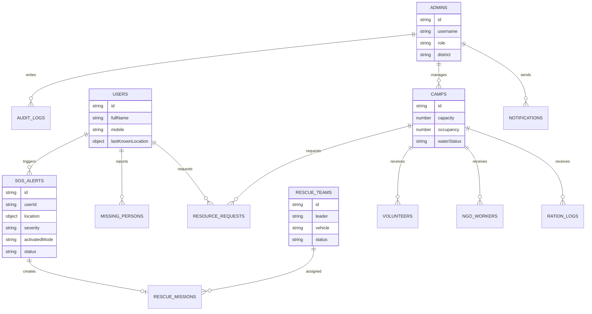

# ER Diagram Logic

```mermaid
erDiagram
  ADMINS ||--o{ AUDIT_LOGS : writes
  ADMINS ||--o{ CAMPS : manages
  USERS ||--o{ SOS_ALERTS : triggers
  USERS ||--o{ MISSING_PERSONS : reports
  USERS ||--o{ RESOURCE_REQUESTS : requests
  SOS_ALERTS ||--o| RESCUE_MISSIONS : creates
  RESCUE_TEAMS ||--o{ RESCUE_MISSIONS : assigned
  CAMPS ||--o{ RESOURCE_REQUESTS : requests
  CAMPS ||--o{ VOLUNTEERS : receives
  CAMPS ||--o{ NGO_WORKERS : receives
  CAMPS ||--o{ RATION_LOGS : receives
  ADMINS ||--o{ NOTIFICATIONS : sends

  ADMINS {
    string id
    string username
    string role
    string district
  }
  USERS {
    string id
    string fullName
    string mobile
    object lastKnownLocation
  }
  SOS_ALERTS {
    string id
    string userId
    object location
    string severity
    string activatedMode
    string status
  }
  RESCUE_TEAMS {
    string id
    string leader
    string vehicle
    string status
  }
  CAMPS {
    string id
    number capacity
    number occupancy
    string waterStatus
  }
```

